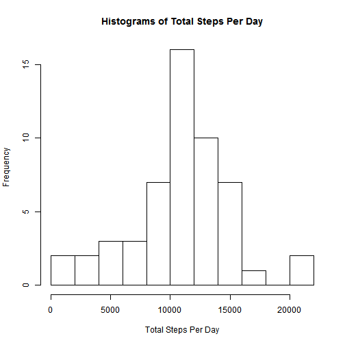

<<<<<<< HEAD
---
title: 'Repdata_Assignment: Course Project 1'
author: "Clara Hyunyoung Shin"
date: "February 21, 2016"
output: html_document
---


## 1. Code for reading in the dataset and/or processing the data

First, read in the data and store the raw data into `dat` parameter.


```r
setwd("C:/Users/Clara.Shin/Downloads/RepData_PeerAssessment1-master/RepData_PeerAssessment1-master")
dat <- read.csv("activity.csv")
```

Let's create a subset called `dat1`, which does not contain any `NA`s.
There are 53 days out of 61 days which have actual steps records.

```r
dat1 <- subset(dat, steps != "NA")
c(length(unique(dat$date)), length(unique(dat1$date)))
```

```
## [1] 61 53
```

Because `date` is a factor, change it into a date format.

```r
dat1$date <- as.Date(dat1$date)
```


## 2. Histogram of the total number of steps taken each day

We will use `plyr` package for rearrange the data. Using `ddply` and `summarise` functions, we can summarize total steps by date. Let's store this new data into `dat2`. 


```r
library(plyr)
dat2 <- ddply(dat1, "date", summarise, totalsteps = sum(steps))
head(dat2)
```

```
##         date totalsteps
## 1 2012-10-02        126
## 2 2012-10-03      11352
## 3 2012-10-04      12116
## 4 2012-10-05      13294
## 5 2012-10-06      15420
## 6 2012-10-07      11015
```

A barplot and a histogram are different. While a barplot depicts the steps by each day, histogram shows the distribution of the steps. 

This is the visualization of total steps per day:


```r
plot(dat2$date, dat2$totalsteps, type = "h", xlab = "Date", ylab = "Total Number of Steps")
```


And this is a **histogram**:


```r
hist(dat2$totalsteps, breaks=10, xlab = "Total Steps Per Day", main = "Histograms of Total Steps Per Day")
```




## 3. Mean and median number of steps taken each day

The mean is **10766.19** and the median is **10765.00**. 


```r
dat3 <- c(mean(dat2$totalsteps), median(dat2$totalsteps))
names(dat3) <- c("mean", "median")
dat3
```

```
##     mean   median 
## 10766.19 10765.00
```


## 4. Time series plot of the average number of steps taken

We will use `ddply` and `summarise` functions, so we can get summarized values of average steps by interval. Let's store this new data into `dat4`. 


```r
dat4 <- ddply(dat1, "interval", summarise, avgsteps = mean(steps))
```

This is a time series plot of `dat4`, which is by 5-minute interval and average number of steps taken, averaged across all days. 


```r
plot(dat4$interval, dat4$avgsteps, type = "l", xlab = "5-minute Interval", ylab = "Average Number of Steps")
```


## 5. The 5-minute interval that, on average, contains the maximum number of steps

The interval containing the maximum average number of steps is **835** minutes.

```r
dat4[which.max(dat4[, 2]), 1]
```

```
## [1] 835
```


## 6. Code to describe and show a strategy for imputing missing data

First, we will get a subset of the original dataset, `dat`, which contains `NA` value. Let's store it into `dat5`. (Sorry for generic names! :p) There are **2304** rows of missing values.


```r
dat5 <- dat[rowSums(is.na(dat)) > 0,]
nrow(dat5)
```

```
## [1] 2304
```

In section 4, we calculated average steps by interval and stored into `dat4`.

```r
head(dat4)
```

```
##   interval  avgsteps
## 1        0 1.7169811
## 2        5 0.3396226
## 3       10 0.1320755
## 4       15 0.1509434
## 5       20 0.0754717
## 6       25 2.0943396
```

We can use this data to impute the missing data! Instead of `NA` value, let's put `dat4`'s average steps by interval. There are 8 days of missing values. So, repeat the dataset 8 times.


```r
dat5$steps <- rep(dat4$avgsteps,8)
```

Then, combine two datasets - `dat1`, which we created first time, without any `NA` values, and `dat5`, data with `NA` values imputed with average values. And then sort by date! 


```r
dat6 <- rbind(dat1, dat5)
dat6 <- dat6[with(dat6, order(date)), ]
dat6$steps <- as.numeric(dat6$steps)
```


## 7. Histogram of the total number of steps taken each day after missing values are imputed

Now we have `dat6`, an imputed data with complete date range. Let's summarize the total steps by date, using `ddply` and `summarise` functions. It is actually a repetition of what we did with `dat1` before. 


```r
dat7 <- ddply(dat6, "date", summarise, totalsteps = sum(steps))
```

This is the histogram. The distribution looks similar, but overall values are increased a bit.  


```r
hist(dat7$totalsteps, breaks=10, xlab = "Total Steps Per Day", main = "Histograms of Total Steps Per Day")
```


Using the same methods above, let's get the mean and median of the data. The mean is **10766.19** and the median is **10766.19**. The mean is same as the original data without missing values, but the median increased a little bit. It is actually same value as the mean. Coincidence?! 


```r
dat8 <- c(mean(dat7$totalsteps), median(dat7$totalsteps))
names(dat8) <- c("mean", "median")
dat8
```

```
##     mean   median 
## 10766.19 10766.19
```


## 8. Panel plot comparing the average number of steps taken per 5-minute interval across weekdays and weekends

First, I created a column called weekday using `weekdays` function. Then, created another column called day, having two levels, that if the weekday is Saturday or Sunday then it is weekend, else it is weekday.


```r
dat6$weekday <- weekdays(dat6$date)
dat6$day[dat6$weekday == "Saturday" | dat6$weekday == "Sunday"] <- "weekend"
dat6$day[dat6$weekday == "Monday" | dat6$weekday == "Tuesday" |
         dat6$weekday == "Wednesday" | dat6$weekday == "Thursday" |
         dat6$weekday == "Friday"] <- "weekday"
```


Prior to make a panel plot, we need to summarize into average steps by interval and day.


```r
dat9 <- ddply(dat6, .(day, interval), summarise, avgsteps = mean(steps))
```

Let's use `lattice` package to make a panel plot. `xyplot` function helps you to do that! 


```r
library(lattice)
xyplot(avgsteps ~ interval| factor(day), 
       data = dat9,
       type = "l",
       xlab = "Interval",
       ylab = "Number of steps",
       layout=c(1,2))
```


On weekdays, we could see a more interesting pattern. In the weekends, the time series had less extreme values and seem to be more evenly. :) 
=======
---
title: 'Repdata_Assignment: Course Project 1'
author: "Clara Hyunyoung Shin"
date: "February 21, 2016"
output: html_document
---


## 1. Code for reading in the dataset and/or processing the data

First, read in the data and store the raw data into `dat` parameter.


```r
setwd("C:/Users/Clara.Shin/Downloads/RepData_PeerAssessment1-master/RepData_PeerAssessment1-master")
dat <- read.csv("activity.csv")
```

Let's create a subset called `dat1`, which does not contain any `NA`s.
There are 53 days out of 61 days which have actual steps records.

```r
dat1 <- subset(dat, steps != "NA")
c(length(unique(dat$date)), length(unique(dat1$date)))
```

```
## [1] 61 53
```

Because `date` is a factor, change it into a date format.

```r
dat1$date <- as.Date(dat1$date)
```


## 2. Histogram of the total number of steps taken each day

We will use `plyr` package for rearrange the data. Using `ddply` and `summarise` functions, we can summarize total steps by date. Let's store this new data into `dat2`. 


```r
library(plyr)
dat2 <- ddply(dat1, "date", summarise, totalsteps = sum(steps))
head(dat2)
```

```
##         date totalsteps
## 1 2012-10-02        126
## 2 2012-10-03      11352
## 3 2012-10-04      12116
## 4 2012-10-05      13294
## 5 2012-10-06      15420
## 6 2012-10-07      11015
```

A barplot and a histogram are different. While a barplot depicts the steps by each day, histogram shows the distribution of the steps. 

This is the visualization of total steps per day:


```r
plot(dat2$date, dat2$totalsteps, type = "h", xlab = "Date", ylab = "Total Number of Steps")
```


And this is a **histogram**:


```r
hist(dat2$totalsteps, breaks=10, xlab = "Total Steps Per Day", main = "Histograms of Total Steps Per Day")
```


## 3. Mean and median number of steps taken each day

The mean is **10766.19** and the median is **10765.00**. 


```r
dat3 <- c(mean(dat2$totalsteps), median(dat2$totalsteps))
names(dat3) <- c("mean", "median")
dat3
```

```
##     mean   median 
## 10766.19 10765.00
```


## 4. Time series plot of the average number of steps taken

We will use `ddply` and `summarise` functions, so we can get summarized values of average steps by interval. Let's store this new data into `dat4`. 


```r
dat4 <- ddply(dat1, "interval", summarise, avgsteps = mean(steps))
```

This is a time series plot of `dat4`, which is by 5-minute interval and average number of steps taken, averaged across all days. 


```r
plot(dat4$interval, dat4$avgsteps, type = "l", xlab = "5-minute Interval", ylab = "Average Number of Steps")
```


## 5. The 5-minute interval that, on average, contains the maximum number of steps

The interval containing the maximum average number of steps is **835** minutes.

```r
dat4[which.max(dat4[, 2]), 1]
```

```
## [1] 835
```


## 6. Code to describe and show a strategy for imputing missing data

First, we will get a subset of the original dataset, `dat`, which contains `NA` value. Let's store it into `dat5`. (Sorry for generic names! :p) There are **2304** rows of missing values.


```r
dat5 <- dat[rowSums(is.na(dat)) > 0,]
nrow(dat5)
```

```
## [1] 2304
```

In section 4, we calculated average steps by interval and stored into `dat4`.

```r
head(dat4)
```

```
##   interval  avgsteps
## 1        0 1.7169811
## 2        5 0.3396226
## 3       10 0.1320755
## 4       15 0.1509434
## 5       20 0.0754717
## 6       25 2.0943396
```

We can use this data to impute the missing data! Instead of `NA` value, let's put `dat4`'s average steps by interval. There are 8 days of missing values. So, repeat the dataset 8 times.


```r
dat5$steps <- rep(dat4$avgsteps,8)
```

Then, combine two datasets - `dat1`, which we created first time, without any `NA` values, and `dat5`, data with `NA` values imputed with average values. And then sort by date! 


```r
dat6 <- rbind(dat1, dat5)
dat6 <- dat6[with(dat6, order(date)), ]
dat6$steps <- as.numeric(dat6$steps)
```


## 7. Histogram of the total number of steps taken each day after missing values are imputed

Now we have `dat6`, an imputed data with complete date range. Let's summarize the total steps by date, using `ddply` and `summarise` functions. It is actually a repetition of what we did with `dat1` before. 


```r
dat7 <- ddply(dat6, "date", summarise, totalsteps = sum(steps))
```

This is the histogram. The distribution looks similar, but overall values are increased a bit.  


```r
hist(dat7$totalsteps, breaks=10, xlab = "Total Steps Per Day", main = "Histograms of Total Steps Per Day")
```


Using the same methods above, let's get the mean and median of the data. The mean is **10766.19** and the median is **10766.19**. The mean is same as the original data without missing values, but the median increased a little bit. It is actually same value as the mean. Coincidence?! 


```r
dat8 <- c(mean(dat7$totalsteps), median(dat7$totalsteps))
names(dat8) <- c("mean", "median")
dat8
```

```
##     mean   median 
## 10766.19 10766.19
```


## 8. Panel plot comparing the average number of steps taken per 5-minute interval across weekdays and weekends

First, I created a column called weekday using `weekdays` function. Then, created another column called day, having two levels, that if the weekday is Saturday or Sunday then it is weekend, else it is weekday.


```r
dat6$weekday <- weekdays(dat6$date)
dat6$day[dat6$weekday == "Saturday" | dat6$weekday == "Sunday"] <- "weekend"
dat6$day[dat6$weekday == "Monday" | dat6$weekday == "Tuesday" |
         dat6$weekday == "Wednesday" | dat6$weekday == "Thursday" |
         dat6$weekday == "Friday"] <- "weekday"
```


Prior to make a panel plot, we need to summarize into average steps by interval and day.


```r
dat9 <- ddply(dat6, .(day, interval), summarise, avgsteps = mean(steps))
```

Let's use `lattice` package to make a panel plot. `xyplot` function helps you to do that! 


```r
library(lattice)
xyplot(avgsteps ~ interval| factor(day), 
       data = dat9,
       type = "l",
       xlab = "Interval",
       ylab = "Number of steps",
       layout=c(1,2))
```


On weekdays, we could see a more interesting pattern. In the weekends, the time series had less extreme values and seem to be more evenly. :) 
>>>>>>> 4bd3b88ca93dddb8ef4d887cbdcee3761533cac3
